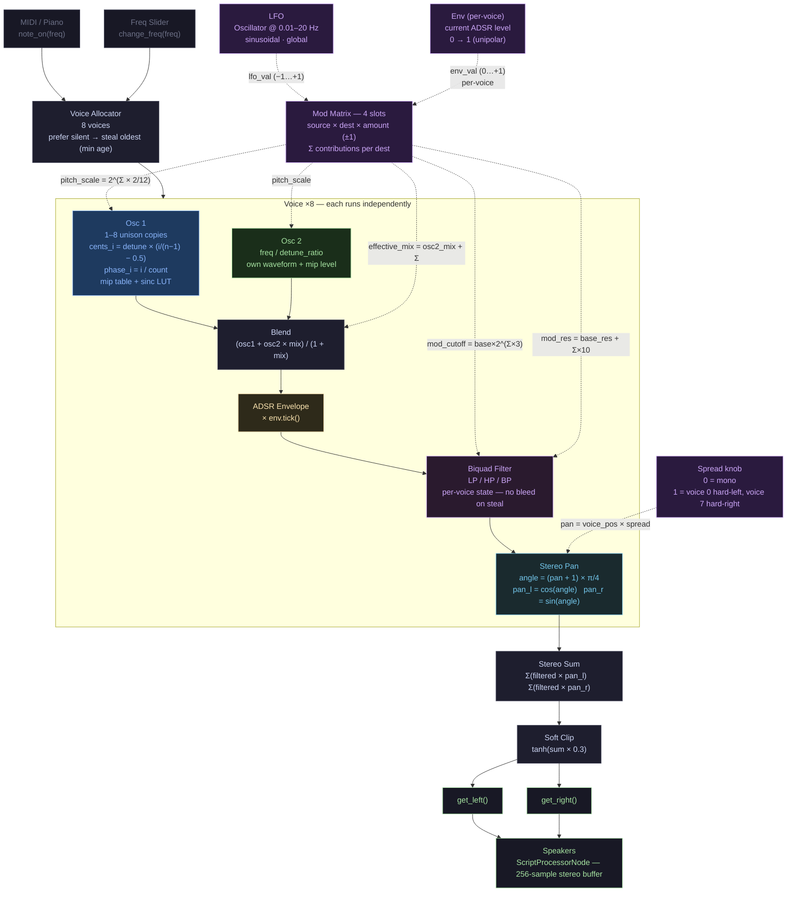

# Synth Architecture

Signal flow from input events through 8 polyphonic voices to stereo output.

## Block reference

| Block | Color | Key parameters | Source |
| ----- | ----- | -------------- | ------ |
| **Voice Allocator** | — | 8 slots, `voice_counter` age, `auto_release` 0.5 s | `wasm_synth.rs` |
| **Osc 1** | blue | waveform, unison count 1–8, detune 0–100 ¢, mip level | `oscillator.rs` |
| **Osc 2** | green | waveform, freq ÷ `detune_ratio` | `oscillator.rs` |
| **Blend** | — | `osc2_mix` 0–1; normalised so amplitude is constant | `wasm_synth.rs` |
| **ADSR** | yellow | attack / decay / sustain / release; rate = 1/(time × sr) | `adsr.rs` |
| **Biquad Filter** | purple | LP / HP / BP; `base_cutoff`, `base_resonance`; Direct Form II T | `filter.rs` |
| **Stereo Pan** | cyan | equal-power cos/sin; `spread` distributes 8 voices −1 → +1 | `wasm_synth.rs` |
| **LFO** | purple (dashed) | reuses `Oscillator` at very low `phase_inc`; sine; global | `wasm_synth.rs` |
| **Env (source)** | purple (dashed) | per-voice ADSR level (0–1) sampled once per tick; same value used for amplitude | `wasm_synth.rs` |
| **Mod Matrix** | purple (dashed) | 4 slots: source × dest × amount (±1); Σ contributions per dest; recomputed every sample, no cleanup needed | `wasm_synth.rs` |
| **Soft Clip** | — | `tanh(sum × 0.3)`; single voice passes almost linear, 8 voices saturate gracefully | `wasm_synth.rs` |

For the theory behind each block see [WAVETABLE_THEORY.md](WAVETABLE_THEORY.md).
